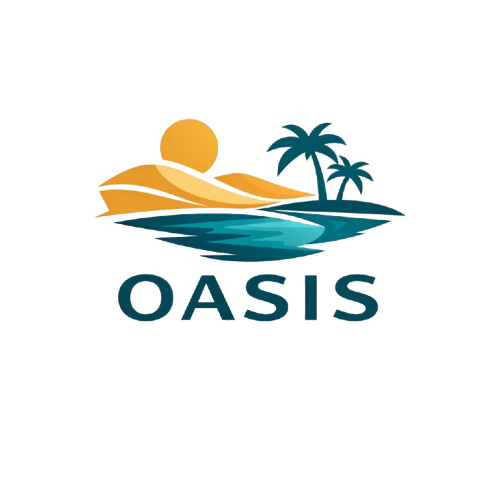

<p align="center">
  
</p>

<h1 align="center">OASIS</h1>
<h3 align="center">Open Agentic Survey Interview System</h3>

<p align="center">
  Self-hosted platform for AI-powered conversational interviews.
  <br/>
  Voice and text. Any model provider. Your infrastructure, your data.
</p>

<p align="center">
  
  
  
  
  
  
  
  
  
  <a href="https://doi.org/10.5281/zenodo.19041570"></a>
</p>

<p align="center">
  <a href="https://oasis-surveys.github.io">Website</a> · <a href="https://oasis-surveys.github.io/docs">Docs</a> · <a href="FAQ.md">FAQ</a> · <a href="https://oasis-surveys.github.io/about">About</a> · <a href="https://oasis-surveys.github.io/license">License</a>
</p>

---

## What is OASIS?

OASIS lets you run conversational AI interviews from your own infrastructure. Define a study, configure an agent with a system prompt and model, share a link with participants. Transcripts are stored in your database. You control the data, the models, and the pipeline.

Built because existing tools for conversational AI aren't designed for research. Things like follow-up probing, semi-structured interview guides, participant tracking, and study-level organization are afterthoughts in commercial platforms. OASIS puts them front and center.

> OASIS launched in March 2026. It works, but it's a young project. If something breaks, [open an issue](https://github.com/oasis-surveys/oasis-platform/issues/new?template=bug_report.yml).

## Demo

<p align="center">
  <strong>1. Setup a Study</strong><br/><br/>
</p>

https://github.com/user-attachments/assets/25633a6b-26c5-4030-89d9-40638b67aff7

<p align="center">
  <strong>2. Create and Configure an Agent</strong><br/><br/>
</p>

https://github.com/user-attachments/assets/4ac63d6e-fdbd-44da-818d-3a4e53417ddc

<p align="center">
  <strong>3. Collect and Manage Data</strong><br/><br/>
</p>

https://github.com/user-attachments/assets/bbf5a613-a28a-4dd0-a962-9250ac1f05a1

## Features

- **Voice + text interviews.** Real-time speech (STT > LLM > TTS) or clean text chat with customizable avatars.
- **Voice-to-voice.** Stream audio directly to multimodal models (OpenAI Realtime, Gemini Live) for lower latency.
- **Semi-structured mode.** Define question guides with follow-up probes and transition logic. The agent follows a structured backbone while keeping conversation natural.
- **Multi-provider.** OpenAI, Google Gemini, Scaleway, Azure, GCP Vertex, or any LiteLLM-compatible provider. Custom model IDs supported.
- **Self-hosted STT/TTS.** OpenAI Whisper, Deepgram, ElevenLabs, Cartesia, Scaleway, or bring your own OpenAI-compatible server.
- **Knowledge base (RAG).** Upload documents, OASIS chunks and embeds them with pgvector. Agents can retrieve relevant context during interviews. Embeddings work with OpenAI or any self-hosted server.
- **Research-first.** Study-level organization, participant identifiers (random/predefined/self-reported), diarized transcripts, session analytics, data export.
- **Phone interviews (beta).** Twilio Media Streams for incoming calls.
- **Self-hosted.** Everything in Docker. No data leaves your infra unless you point at external APIs. Optional dashboard auth.

See the [FAQ](FAQ.md) for questions about self-hosting, HPC clusters, European cloud providers, and running with fully open-source models.

## Architecture

Five Docker containers on one internal network:

| Container | Stack | Role |
|-----------|-------|------|
| **Caddy** | Caddy 2 | Reverse proxy, auto HTTPS |
| **Frontend** | React, Tailwind, Nginx | Dashboard + interview widget |
| **Backend** | FastAPI, Pipecat, LiteLLM | WebSocket transport, AI pipeline, REST API |
| **PostgreSQL** | pgvector/pg16 | Configs, transcripts, participant data, embeddings |
| **Redis** | Redis 7 | Sessions, real-time pub/sub, API key overrides |

```
┌──────────────────────────────────────────────────────────┐
│                     Caddy (ports 80/443)                 │
│                    ┌──────────┬──────────┐               │
│                    │ Frontend │ Backend  │               │
│                    │ (React)  │ (FastAPI)│               │
│                    └────┬─────┴────┬─────┘               │
│                         │          │                     │
│                    ┌────┴────┐ ┌───┴───┐                 │
│                    │PostgreSQL│ │ Redis │                 │
│                    └─────────┘ └───────┘                 │
└──────────────────────────────────────────────────────────┘
```

## Quick Start

You need Docker and at least one AI provider API key.

```bash
git clone https://github.com/oasis-surveys/oasis-platform.git
cd oasis-platform
cp .env.example .env
# Edit .env with your API keys
docker compose up -d
```

Open `http://localhost`. That's it.

### Minimal `.env`

```env
OPENAI_API_KEY=sk-...
SECRET_KEY=some-random-secret

# For voice interviews (pick your providers)
DEEPGRAM_API_KEY=...
ELEVENLABS_API_KEY=...
```

See `.env.example` for all options (Google, Scaleway, Azure, GCP, self-hosted STT/TTS, Twilio, auth, etc).

### First study

1. Click **New Study** in the dashboard
2. Add an agent, write a system prompt, pick your models
3. Set the agent to **Active**
4. Copy the interview link, share it

## Project Structure

```
oasis/
├── backend/
│   ├── app/
│   │   ├── api/          # REST + WebSocket endpoints
│   │   ├── models/       # SQLAlchemy ORM models
│   │   ├── schemas/      # Pydantic request/response schemas
│   │   ├── pipeline/     # Pipecat pipeline runner
│   │   ├── knowledge/    # RAG: chunking, embedding, retrieval
│   │   ├── config.py     # Environment settings
│   │   └── main.py       # FastAPI entry point
│   ├── alembic/          # DB migrations
│   ├── tests/
│   └── Dockerfile
├── frontend/
│   ├── src/
│   │   ├── pages/        # Dashboard + interview widget
│   │   ├── components/   # Shared UI
│   │   ├── contexts/     # React contexts
│   │   └── lib/          # API client, utils
│   └── Dockerfile
├── docker/
│   └── Caddyfile
├── docker-compose.yml
└── .env.example
```

## Testing

All external calls are mocked. No API keys needed to run tests.

```bash
# Backend
cd backend && pip install -r requirements.txt && pytest tests/ -v --cov=app

# Frontend
cd frontend && npm install && npx vitest run
```

CI runs on every push + weekly scheduled run.

## Why

Commercial conversational AI platforms are built for support and sales. Research needs different things:

- **Methodological control.** Semi-structured guides, probing logic, participant tracking built in, not bolted on.
- **Transparency.** Reviewers should know what system, models, and data storage you used.
- **Affordability.** Academic budgets aren't enterprise budgets. Self-hosting with pay-as-you-go API keys is often the only option.
- **Data sovereignty.** Especially in Europe, running your own infrastructure is often a compliance requirement.

## Contributing

Contributions welcome. Read [CONTRIBUTING.md](CONTRIBUTING.md) first.

- [Bug reports](https://github.com/oasis-surveys/oasis-platform/issues/new?template=bug_report.yml)
- [Feature requests](https://github.com/oasis-surveys/oasis-platform/issues/new?template=feature_request.yml)
- Questions: [max.lang@stx.ox.ac.uk](mailto:max.lang@stx.ox.ac.uk)

## License

**Open Non-Commercial Research License (ONCRL) v1.0.**

Free to use, modify, and share for non-commercial research and education. Using OASIS as a core component of a funded research project or grant application requires prior written approval from the copyright holder (not meant as a barrier, just helps us track usage and attribution).

For hosted/managed service inquiries, [get in touch](mailto:max.lang@stx.ox.ac.uk). See the full [LICENSE](LICENSE) file.

## Citation

```bibtex
@software{lang2026oasis,
  author       = {Lang, Max M.},
  title        = {{OASIS}: Open Agentic Survey Interview System},
  year         = {2026},
  url          = {https://github.com/oasis-surveys/oasis-platform},
  note         = {Self-hosted platform for AI-powered conversational interviews},
  doi          = {10.5281/zenodo.19041570}
}
```
